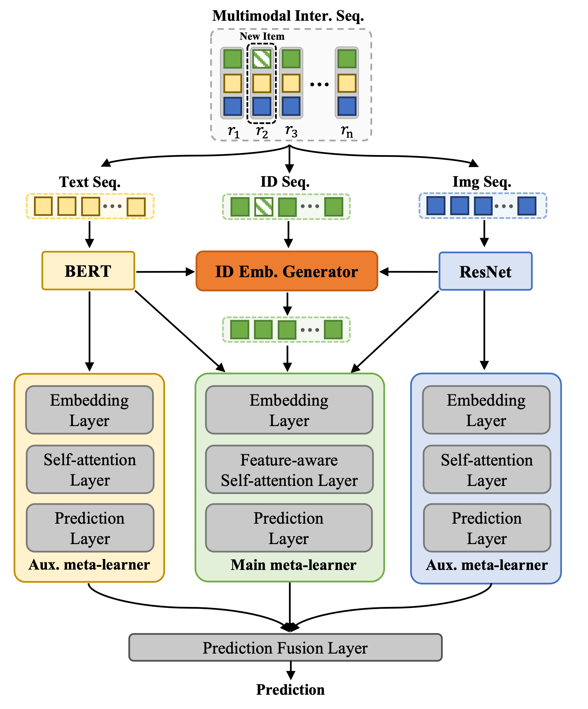

# Code for MML

This is the resource code for our work.
> Xingyu Pan, Yushuo Chen, Changxin Tian, Zihan Lin, Jinpeng Wang, He Hu and Wayne Xin Zhao. "Multimodal Meta-Learning for Cold Start Sequential Recommendation"

## Overview
In this paper, we study the problem of cold-start sequential recommendation, where new users with very short interaction sequences come with time. We cast this problem as a few-shot learning problem and adopt a meta-learning approach to develop our solution. A major obstacle of effective knowledge transfer that is there exists significant characteristic divergence between old and new interaction sequences for meta-learning. To address the above issues, we purpose a Multimodal Meta Learning (denoted as MML) approach that incorporates multimodal side information of items (e.g., text and image) into the meta-learning process, to stabilize and improve the meta-learning process for cold-start sequential recommendation. In specific, we design a group of multimodal meta-learners corresponding to each kind of modality, where ID features are used to develop the main meta-learner and the rest text and image features are used to develop auxillary meta-learners. Instead of simply combing the predictions from different meta-learners, we design an adaptive, learnable fusion layer to integrate the predications based on different modalities. Meanwhile, we design a cold-start item embedding generator, which utilize multimodal side information to warm up the ID embeddings of new items.
Extensive offline and online experiments demonstrate that MML can significantly improve the recommendation performance for cold-start users compared with baseline models.

<p align="center">
  
  <br>
  <b>Figure</b>: Overall Architecture of MML
</p>

## Reproducing
We provide the script for reproducing the experimental results in this repository.
For example, if you want to get the result for `hangzhou`, 
you should firstly download the data files and put them into `dataset/hangzhou` folder.

**NOTE: Due to privacy policies, our data is not availiable temporarily.**
### Data format example:
Our input data format is followed [RecBole](https://github.com/RUCAIBox/RecBole), click [here](https://recbole.io/docs/user_guide/data/atomic_files.html) for more information about input data format in RecBole. Here, we take `hangzhou` dataset as an example.

`hangzhou.inter` (user-item interaction data):
```
user_id:token item_id:token
1 1234
2 1235
...
```

For multimodal information file, please refer [prepare multimodal information file](https://github.com/RUCAIBox/MML/blob/main/prepare_multimodal_information_file)
 
### Run the model:
After data preparation, you can execute the following command:
```bash
bash script/run_meta.sh hangzhou 0
```
`0` represent the GPU id to execute our code, you can change it as you need. 

We also provide the script for showing the result in this repository.
You can execute the following command to get the result for our model.
```bash
bash script/print_result.sh
```

## Acknowledgement
Our implementation is based on [RecBole](https://github.com/RUCAIBox/RecBole) framework.
